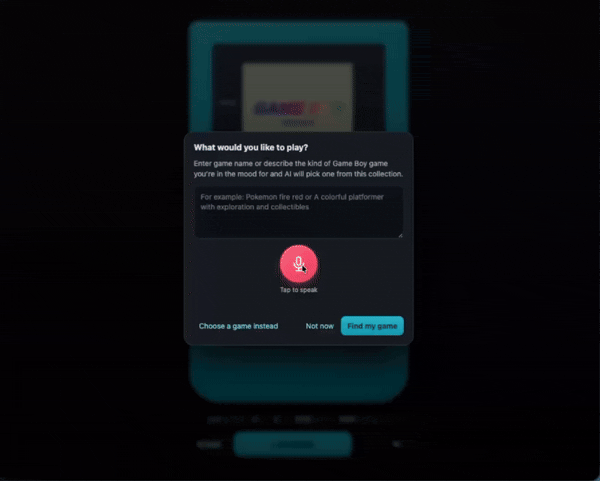

# Browser-based Gameboy Color Emulator
## with AI game search capabilities using Google gemma 4b

> Note: For the AI feature to work you need to have [https://ollama.com/library/gemma3:4b](https://ollama.com/library/gemma3:4b) installed and running on your machine. 

in the package.json file there is a script called "start:ai" which will start the ollama server.

How the codebase works:

- `index.html` provides the emulator screen, controls, game picker, and AI prompt; `src/style.css` styles the interface.
- `src/main.ts` connects the UI to the mGBA WebAssembly emulator. It loads ROMs from `public/gameroms` (including ROMs inside ZIP files), handles keyboard, touch, and gamepad input, and manages game state.
- `src/games.ts` lists the ROM filenames available to browse and recommend. Add ROM files to `public/gameroms` and include their names in this list.
- The AI picker sends the player’s request and available game list to Ollama’s local `gemma3:4b` model through `src/utils/ai.ts`, then loads the selected game. The mic uses the browser’s speech-recognition API to fill the prompt and submit it when listening ends; support depends on the browser.
